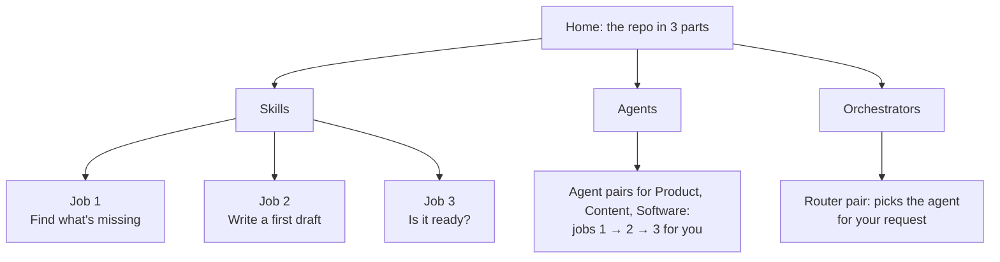

# Web version: the skills, explained in your browser

**Try it:** https://khadir-syed.github.io/k_ai-agent-skills/web/

The site follows the repo's three parts:

- **Skills:** https://khadir-syed.github.io/k_ai-agent-skills/web/skills/
  - Job 1 — Find what's missing, or find out why: [`skills/find/`](skills/find/)
  - Job 2 — Write me a first draft: [`skills/draft/`](skills/draft/)
  - Job 3 — Is it ready to go?: [`skills/check/`](skills/check/)
- **Agents:** https://khadir-syed.github.io/k_ai-agent-skills/web/agents/
  - Product team — Do the whole job with me: [`agents/together/`](agents/together/)
  - Content team — Get a post ready to publish: [`agents/content/`](agents/content/)
  - Software team — Find and fix a bug: [`agents/software/`](agents/software/)
- **Orchestrators:** https://khadir-syed.github.io/k_ai-agent-skills/web/orchestrators/
  - Send it to the right agent: [`orchestrators/`](orchestrators/)

## What is this?

The skills in this repo are recipe cards for an AI helper. Reading a recipe
card is hard if you've never cooked — so these pages show the cooking
instead. Each page takes one job, explains it with an everyday comparison,
draws it as a picture, and then shows a **real recorded run**: exactly what
we asked a real AI, and exactly what it answered.

The skill pages are sorted by the job you need done, not by how the repo's
folders are laid out. Each job page explains the job once, then has a tab
per team (Product, Content, Social media, Software) with that team's skill,
its request and its real run. They follow one story: Sales asks for "an
export button", and each job moves it one step closer to launch.



Good to know:

- **The pages never talk to an AI.** They only show runs that were recorded
  earlier and saved in [`runs/`](runs/). Nothing you do on the page is sent
  anywhere.
- **Nothing to install.** No sign-up, no downloads, no scripts from other
  websites — only this site's own files and the GitHub profile photo.
- **The requests on each page are the repo's own examples.** Each page shows
  the prompt and background from the skill's `examples/` file, word for word,
  and [`test_web.py`](test_web.py) checks they still match.

## How the files fit together

| File | What it does |
|---|---|
| `index.html` | Home page: what skills, agents and orchestrators are |
| `skills/index.html` | What a skill is, and one card per job |
| `skills/find/`, `skills/draft/`, `skills/check/` | One page per job, with a tab per team. All English text is written right in the page |
| `agents/index.html`, `agents/together/`, `agents/content/`, `agents/software/` | What an agent is, and each agent pair (Product, Content, Software) side by side |
| `orchestrators/` | The two request routers side by side, both given the same bug |
| `find/`, `draft/`, `check/`, `together/` | Tiny redirects from the old addresses, so links shared earlier still work |
| `runs/<skill-name>.md` | The recorded runs (see below) |
| `run.js` | Loads a recorded run and shows it: the start of a long answer, the rest behind "Show all" |
| `markdown.js` | Turns the AI's formatting symbols (`##`, `**`, tables) into headings, bold and tables — safely, as plain text only. Copied from k_ai-basics, plus code blocks, `code` and quotes |
| `style.css` | Colours match https://khadir-syed.github.io; each job has its own warm accent. The team tabs are plain radio buttons styled here, so they need no scripts |
| `test_web.py` | The self-check (below) |

The pictures are drawn right inside each page (inline SVG) and coloured by
`style.css`, so they need no scripts and stay sharp on a phone.

## Adding a recorded run

A run file is named after the skill folder, like
`runs/requirements-gap-investigator.md`. It starts with four header lines,
then a blank line, then the AI's reply pasted exactly as it came. The only
edit allowed is taking out personal details (a folder path on your computer,
your time zone, names, emails): replace them with something plain like
`launch-brief.md` or a visible `[time zone removed]`, and say so on the page.

```text
Date: 2026-09-26
Tool: Codex CLI 0.154.0
Model: gpt-5.6-sol
Example: skills/product/requirements-gap-investigator/examples/vague-export-request.md

<the AI's reply, unedited apart from personal details>
```

When a run has several turns (the agents stop to ask you), put a marker line
before each turn:

```text
=== AI ===
<what the AI said>
=== YOU ===
<what you typed back>
=== FILE launch-brief.md ===
<the file the AI saved>
```

To record one: use a fresh clone, run `install.sh`, start a new session,
and paste the example file's prompt and background (not its "Expected…"
section — that would give the answer away). Keep the repo's `AGENTS.md`
(or `CLAUDE.md`) in the folder you record in: it tells the AI to follow the
invoked skill rather than any personal default style you've set up.

`test-fix-loop-agent` is a program, not a chat, so its run is what the
program printed, inside a `text` code block, starting with the command line
(`$ python3 agent.py …`); the page shows that same command. It calls its AI
with `-p "<prompt>"` (Claude Code's style); to record it with Codex like the
other runs, point `--cli` at a two-line script that passes the prompt to
`codex exec` instead, and say so on the page.

The autonomous orchestrator runs that same program itself, from inside its
AI's sandbox, which has no internet. To record it, put a stand-in `claude`
first on the sandbox's `PATH` that only leaves the prompt as a note in the
folder; a helper outside the sandbox passes each note to Codex and writes
the answer back. Record every message the orchestrator says (`codex exec
--json`), not only its last one, so its warning before the run is kept.
The controlled orchestrator's run stops at its handoff: after that it *is*
`bug-fix-agent`, whose full run is already on the Software page.

## Check it before publishing

From the repo root:

```bash
python3 web/test_web.py
```

It checks, with no network:

- every page keeps its strict safety rules (no inline scripts or styles, no
  scripts from other sites) and every link leads somewhere real;
- each request shown on a page matches the repo's example file word for word;
- every skill in `skills/` has its own tab, with one request and one run;
- the old addresses still redirect to the moved pages;
- every recorded run exists, has its Date, Tool, Model and Example lines,
  and is shown without losing words or leaving raw `##` / `|` symbols
  (this part needs `node`);
- each agent pair's runs match its page's picture: Product and Content
  controlled 3 stops, autonomous 1; Software controlled 2, the loop program 0;
- the command shown for the loop program is the one its run shows;
- each orchestrator run matches its picture (controlled 1 stop, autonomous
  0), only names agents that exist and are on that orchestrator's own list,
  and the autonomous one gives its "no further approval requests" warning
  before its result.

To look at the pages locally:

```bash
python3 -m http.server 8765 --bind 127.0.0.1
```

Then open http://127.0.0.1:8765/web/.

## Publishing

[`.github/workflows/pages.yml`](../.github/workflows/pages.yml) publishes
the repo to GitHub Pages on every push to `main`. The repo's Pages source
must be set to **GitHub Actions** (Settings → Pages). The actions it uses
are pinned to exact commits, so a changed release can't slip in.
